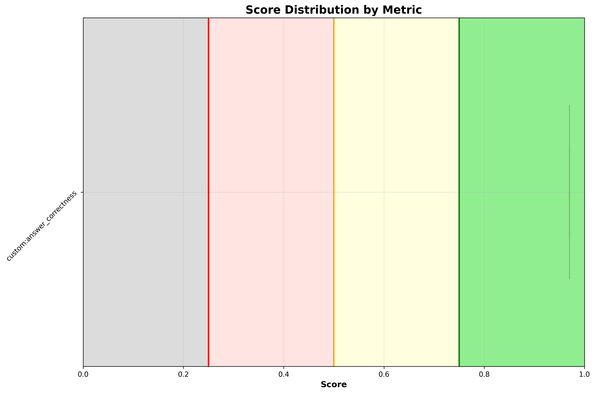

# ✅ check_istioObject_status

**OLS model:** `openai/gpt-5` &nbsp;|&nbsp; **Judge:** `openai/gpt-5.4-mini`  
**Run:** 2026-06-15 11:28:44 &nbsp;|&nbsp; **Evaluations:** 1 &nbsp;|&nbsp; ✅ 1 PASS &nbsp; ❌ 0 FAIL &nbsp; ⚠️ 0 ERROR &nbsp; (100%)

> A misconfigured VirtualService (reviews-bad-config) is deployed in bookinfo with four Kiali validation errors: missing gateway, undefined subset, non-existent destination host, and route weights not summing to 100.

---

## Pass Rates


<details>
<summary>More graphs</summary>

### Score Distribution



### Status Breakdown


</details>

## Metrics

| Metric | ✅ | ❌ | ⚠️ | Pass Rate | Mean Score |
|---|---|---|---|---|---|
| `custom:answer_correctness` | 1 | 0 | 0 | ✅ 100% | 0.97 |

## Turns

### Turn: `diagnose`

**Metrics:** `custom:answer_correctness`

**Query:** I deployed a VirtualService called reviews-bad-config in the bookinfo namespace but I think it has some configuration problems. Can you check the Istio objects in that namespace and tell me if there are any validation errors or issues I should fix?

| Metric | Result | Score |
|---|---|---|
| `custom:answer_correctness` | ✅ PASS | `████████████████` 0.97 |

<details>
<summary>Actual tool calls</summary>

- `kiali_manage_istio_config_read`(action=list, namespace=bookinfo)
- `kiali_manage_istio_config_read`(action=get, group=networking.istio.io, kind=VirtualService, namespace=bookinfo, …)
- `resources_list`(apiVersion=v1, kind=Service, namespace=bookinfo)

</details>

<details>
<summary>Agent response</summary>

```
Assessment of Istio config in namespace bookinfo

Findings (with evidence)
- VirtualService reviews-bad-config (bookinfo)
  - Validation: invalid
  - Errors/Warnings:
    1) ERROR KIA1102: VirtualService is pointing to a non-existent gateway
       - Path: spec/gateways[0]
       - Value: bookinfo-missing-gateway
       - Evidence: Only Gateway present is bookinfo-gateway.
    2) WARNING KIA1101: DestinationWeight on route doesn't have a valid service (host not found)
       - Path: spec/http[0]/route[1]/destination/host
       - Value: fake-service
       - Evidence: Services in bookinfo: details, productpage, ratings, reviews, istio-ingressgateway. No fake-service.
    3) WARNING KIA1107: Subset not found
       - Path: spec/http[0]/route[0]/destination (reviews subset v99)
       - Cause: No DestinationRule defines subsets for reviews.
    4) WARNING KIA1107: Subset not found
       - Path: spec/http[1]/route[0]/destination (reviews subset v1)
       - Cause: No DestinationRule defi…
```

</details>

<details>
<summary>Expected response</summary>

The agent should use Kiali/OSSM MCP tools to list and inspect the Istio configuration objects in the bookinfo namespace, retrieve the full spec of reviews-bad-config, and cross-check referenced Gateways, Services, and DestinationRules. It should report the VirtualService as invalid and identify the following Kiali validation errors:
KIA1102 — Gateway not found: spec.gateways references bookinfo-missing-gateway which does not exist in bookinfo; the agent should note the existing valid Gateway (e.g. bookinfo-gateway) and recommend pointing to it instead.
KIA1101 — Destination host not found: a route destination references fake-service which is not a known Service in bookinfo; the agent should list the existing services and recommend removing or replacing that destination.
KIA1107 — Subset not found: the routes reference subsets (e.g. v99, v1) on host reviews, but there is no DestinationRule for reviews in bookinfo defining any subsets; the agent should recommend creating a DestinationRule with the intended subsets (v1/v2/v3).
The agent may additionally note that route weights do not sum to 100 (80+10=90) as a hygiene issue. For each finding the agent should cite the evidence from the tool output (path, spec excerpt, existing resources) and provide a concrete fix, ideally including a corrected VirtualService example.

</details>

---

*Tokens — Judge: 1,652 | API: 8,013 | Total: 9,665*
*Latency — mean: 28.3s | p95: 28.3s*