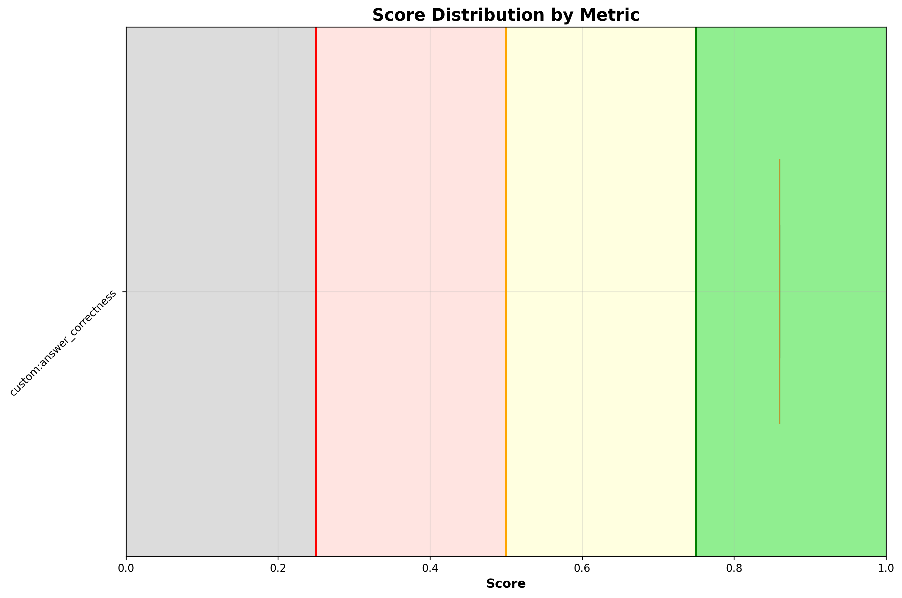

# ✅ check_mesh_status

**OLS model:** `openai/gpt-5` &nbsp;|&nbsp; **Judge:** `openai/gpt-5.4-mini`  
**Run:** 2026-06-15 11:22:04 &nbsp;|&nbsp; **Evaluations:** 1 &nbsp;|&nbsp; ✅ 1 PASS &nbsp; ❌ 0 FAIL &nbsp; ⚠️ 0 ERROR &nbsp; (100%)

> Check the status of the mesh and identify any issues.

---

## Pass Rates


<details>
<summary>More graphs</summary>

### Score Distribution



### Status Breakdown


</details>

## Metrics

| Metric | ✅ | ❌ | ⚠️ | Pass Rate | Mean Score |
|---|---|---|---|---|---|
| `custom:answer_correctness` | 1 | 0 | 0 | ✅ 100% | 0.86 |

## Turns

### Turn: `diagnose`

**Metrics:** `custom:answer_correctness`

**Query:** Check the status of the mesh and identify any issues.

| Metric | Result | Score |
|---|---|---|
| `custom:answer_correctness` | ✅ PASS | `██████████████░░` 0.86 |

<details>
<summary>Actual tool calls</summary>

- `kiali_get_mesh_status`()
- `pods_list_in_namespace`(namespace=istio-system)
- `resources_list`(apiVersion=v1, kind=Service, namespace=istio-system)

</details>

<details>
<summary>Agent response</summary>

```
Assessment of Istio mesh

Summary
- Control plane: Healthy
  - istiod 1.28.0 running in istio-system (pod: istiod-d468976dc-jvnxn)
- Data plane: Healthy
  - Monitored namespaces: bookinfo, default
- Observability stack:
  - Prometheus: Healthy (service istio-system/prometheus; pod prometheus-6964c8fbb8-2g9gx)
  - Jaeger: Healthy (pod jaeger-555f5df568-mjv7h)
  - Grafana: Unreachable

Evidence
- Mesh status (timestamp 2026-06-15T11:21:45Z):
  - control_plane.status: Healthy; istiod version 1.28.0
  - data_plane.monitored_namespaces: bookinfo (HEALTHY), default (HEALTHY)
  - observability_stack.grafana: Unreachable; prometheus: Healthy; jaeger: Healthy
  - connectivity_graph: kiali → Grafana: Unreachable; all other links Healthy
  - critical_alerts: Grafana is Unreachable (impact: Grafana dashboards unavailable)
- istio-system namespace pods:
  - istiod-d468976dc-jvnxn (Ready/Running)
  - istio-ingressgateway-7554995647-7269j (Ready/Running)
  - istio-egressgateway-69b8465445-k6xzp (Read…
```

</details>

<details>
<summary>Expected response</summary>

The agent should use Kiali/OSSM MCP tools to provide a structured Istio mesh health assessment organized as: (1) control plane — report istiod version and health; (2) observability stack — list each component (Prometheus, Grafana, Tempo/Jaeger) with Healthy or Unreachable status; (3) data plane — report the overall health of monitored namespaces with any DEGRADED or UNHEALTHY namespaces called out. For each issue found, the agent should cite specific evidence from tool output (error rates, log lines, pod status, graph edges), explain the likely root cause, and provide a concrete remediation step. The response should be well-structured, grounded in observed Kiali and Kubernetes data, and end with a prioritized action list.

</details>

---

*Tokens — Judge: 1,144 | API: 8,900 | Total: 10,044*
*Latency — mean: 19.5s | p95: 19.5s*