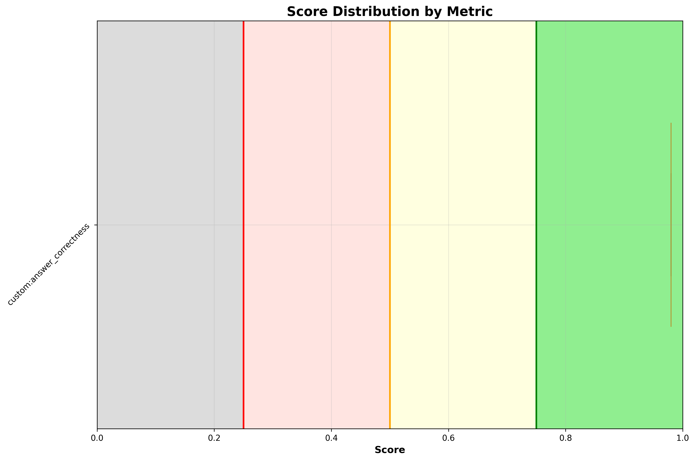
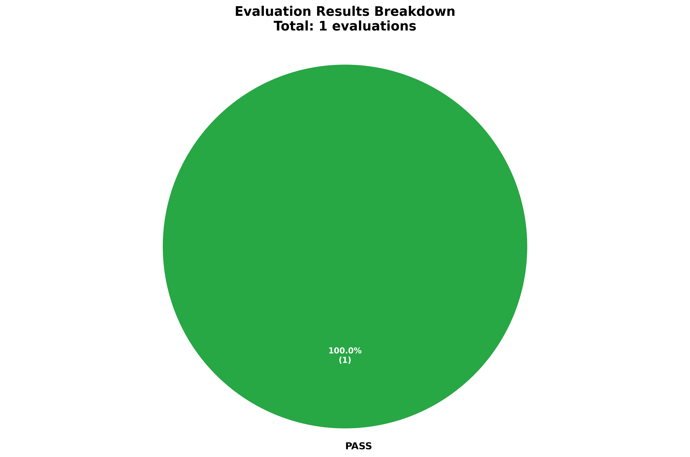

# ✅ fix_bookinfo_fault_injection

**OLS model:** `openai/gpt-5` &nbsp;|&nbsp; **Judge:** `openai/gpt-5.4-mini`  
**Run:** 2026-06-15 11:44:23 &nbsp;|&nbsp; **Evaluations:** 1 &nbsp;|&nbsp; ✅ 1 PASS &nbsp; ❌ 0 FAIL &nbsp; ⚠️ 0 ERROR &nbsp; (100%)

> Multi-turn: a 100% fault injection on ratings causes 503 errors. Agent investigates, identifies root cause, and fixes it.

---

## Pass Rates


<details>
<summary>More graphs</summary>

### Score Distribution



### Status Breakdown



</details>

## Metrics

| Metric | ✅ | ❌ | ⚠️ | Pass Rate | Mean Score |
|---|---|---|---|---|---|
| `custom:answer_correctness` | 1 | 0 | 0 | ✅ 100% | 0.98 |

## Turns

### Turn: `investigate_and_fix`

**Metrics:** `custom:answer_correctness`

**Query:** Some users are seeing errors on the Bookinfo product page — it looks like the ratings service is broken. All pods are running and mTLS / auth policies are not the issue. All Istio resources are in the 'bookinfo' namespace. Can you check the Istio VirtualService routing rules for the ratings service and find what's causing the problem?

| Metric | Result | Score |
|---|---|---|
| `custom:answer_correctness` | ✅ PASS | `████████████████` 0.98 |

<details>
<summary>Actual tool calls</summary>

- `kiali_manage_istio_config_read`(action=list, namespace=bookinfo, serviceName=ratings)
- `kiali_manage_istio_config_read`(action=get, group=networking.istio.io, kind=VirtualService, namespace=bookinfo, …)

</details>

<details>
<summary>Agent response</summary>

```
Diagnosis
- Evidence:
  - Istio VirtualService bookinfo/ratings (networking.istio.io/v1) contains an HTTP fault injection:
    - spec.http[0].fault.abort.httpStatus: 503
    - spec.http[0].fault.abort.percentage.value: 100
    - Route targets ratings.bookinfo.svc.cluster.local subset v1 at weight 100
  - Object details:
    - name: ratings
    - namespace: bookinfo
    - creationTimestamp: 2026-06-15T11:38:06Z
- Root cause:
  - The VirtualService is deliberately aborting 100% of requests to the ratings service with HTTP 503. This causes productpage calls to ratings to fail, even though all pods are running and mTLS/auth are fine.

Fix/Mitigation
- Immediate mitigation (reversible):
  - Remove the fault injection block from the VirtualService, or set percentage.value to 0. After removal, traffic will route to ratings v1 normally.
- Corrected VirtualService spec (example):
  - hosts: ["ratings.bookinfo.svc.cluster.local"]
  - http:
    - route:
      - destination:
          host: rating…
```

</details>

<details>
<summary>Expected response</summary>

The agent should find and cite the ratings VirtualService spec showing a fault.abort block with httpStatus 503 and percentage value 100, applying to all traffic with no match conditions. It should confirm the DestinationRule for ratings is correctly defined and not contributing to the issue. It should identify the 100% fault injection abort as the root cause of the 503 errors seen on the product page, and may note this is typically used for chaos or resilience testing. The agent should offer to remove the fault injection rule (e.g. by deleting the abort block or setting percentage to 0) to restore normal service, and may provide the corrected VirtualService spec.

</details>

---

*Tokens — Judge: 781 | API: 4,335 | Total: 5,116*
*Latency — mean: 13.3s | p95: 13.3s*