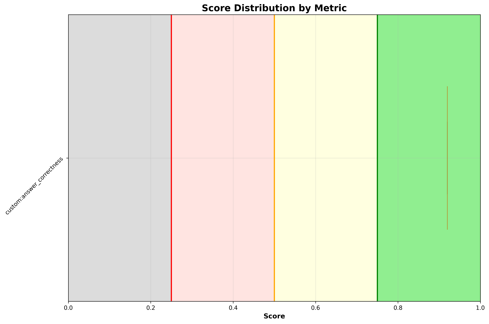

# ✅ fix_bookinfo_routing

**OLS model:** `openai/gpt-5` &nbsp;|&nbsp; **Judge:** `openai/gpt-5.4-mini`  
**Run:** 2026-06-15 11:37:53 &nbsp;|&nbsp; **Evaluations:** 1 &nbsp;|&nbsp; ✅ 1 PASS &nbsp; ❌ 0 FAIL &nbsp; ⚠️ 0 ERROR &nbsp; (100%)

> Multi-turn: reviews-v3 has weight 0 so never gets traffic. Agent investigates, identifies the routing issue, and fixes weights.

---

## Pass Rates


<details>
<summary>More graphs</summary>

### Score Distribution



### Status Breakdown


</details>

## Metrics

| Metric | ✅ | ❌ | ⚠️ | Pass Rate | Mean Score |
|---|---|---|---|---|---|
| `custom:answer_correctness` | 1 | 0 | 0 | ✅ 100% | 0.92 |

## Turns

### Turn: `investigate`

**Metrics:** `custom:answer_correctness`

**Query:** In our Bookinfo app, the product page only ever shows black or no stars.It never shows red stars.  All Istio resources and services are deployed in the 'bookinfo' namespace. Can you investigate and fix it?

| Metric | Result | Score |
|---|---|---|
| `custom:answer_correctness` | ✅ PASS | `███████████████░` 0.92 |

<details>
<summary>Actual tool calls</summary>

- `pods_list_in_namespace`(namespace=bookinfo)
- `kiali_get_mesh_traffic_graph`(namespaces=bookinfo, graphType=versionedApp)
- `kiali_manage_istio_config_read`(action=list, namespace=bookinfo)
- `kiali_manage_istio_config_read`(action=get, group=networking.istio.io, kind=VirtualService, namespace=bookinfo, …)
- `kiali_manage_istio_config_read`(action=get, group=networking.istio.io, kind=VirtualService, namespace=bookinfo, …)
- `kiali_manage_istio_config_read`(action=get, group=networking.istio.io, kind=DestinationRule, namespace=bookinfo, …)
- `kiali_manage_istio_config`(action=patch, group=networking.istio.io, kind=VirtualService, namespace=bookinfo, …)
- `kiali_get_mesh_traffic_graph`(namespaces=bookinfo, graphType=versionedApp)

</details>

<details>
<summary>Agent response</summary>

```
Diagnosis
- Scope
  - Namespace: bookinfo
  - Affected path: productpage → reviews → ratings
- Evidence
  - Workloads present and Ready:
    - Pods (bookinfo): 
      - productpage-v1-574c45789d-qfplk (2/2 Running)
      - reviews-v1-7bbc4c5497-7tkjv (2/2 Running)
      - reviews-v2-7b5b4d5d65-h8r4t (2/2 Running)
      - reviews-v3-5bcf66d84f-rldpv (2/2 Running)
      - ratings-v1-59d4b8b76f-cjl7p (2/2 Running)
      - details-v1-6cc9db646f-2zzcq (2/2 Running)
      - istio-ingressgateway-6d65dbb4f5-h8s2b (1/1 Running)
  - Istio config present in bookinfo:
    - VirtualService/bookinfo (valid)
    - DestinationRule/reviews (valid)
    - VirtualService/reviews (valid)
  - VirtualService/reviews BEFORE fix:
    - hosts: reviews.bookinfo.svc.cluster.local
    - http.route:
      - subset v1 weight 50
      - subset v2 weight 50
      - subset v3 weight not specified (annotation shows it was applied with weight 0)
    - This configuration effectively routed 0% of traffic to reviews v3, whi…
```

</details>

<details>
<summary>Expected response</summary>

The agent should inspect workloads, the reviews VirtualService, and the reviews DestinationRule in the bookinfo namespace. It should identify that the reviews VirtualService routes 0% of traffic to subset v3 (weight: 0), meaning reviews-v3 — the version that renders red stars — never receives requests. All workload pods should be confirmed as running and healthy. The agent should apply a fix by patching the reviews VirtualService to send traffic to v3 (either 100% to v3 or distributing across v1/v2/v3), confirm the patch by reporting the updated spec, and explain that the product page should now show red stars.

</details>

---

*Tokens — Judge: 1,339 | API: 31,522 | Total: 32,861*
*Latency — mean: 51.4s | p95: 51.4s*