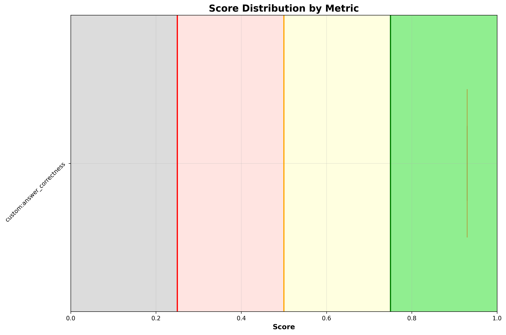

# ✅ troubleshoot_latency_trace

**OLS model:** `openai/gpt-5` &nbsp;|&nbsp; **Judge:** `openai/gpt-5.4-mini`  
**Run:** 2026-06-15 11:51:06 &nbsp;|&nbsp; **Evaluations:** 1 &nbsp;|&nbsp; ✅ 1 PASS &nbsp; ❌ 0 FAIL &nbsp; ⚠️ 0 ERROR &nbsp; (100%)

> A 3-second delay fault is injected on the ratings service. The agent must identify the latency root cause using traces and fix the delay.

---

## Pass Rates


<details>
<summary>More graphs</summary>

### Score Distribution



### Status Breakdown


</details>

## Metrics

| Metric | ✅ | ❌ | ⚠️ | Pass Rate | Mean Score |
|---|---|---|---|---|---|
| `custom:answer_correctness` | 1 | 0 | 0 | ✅ 100% | 0.93 |

## Turns

### Turn: `investigate_and_fix`

**Metrics:** `custom:answer_correctness`

**Query:** The Bookinfo product page is loading very slow — requests to the page are taking several seconds. All pods are running fine. Can you investigate what is causing the latency and tell me which service is responsible?

| Metric | Result | Score |
|---|---|---|
| `custom:answer_correctness` | ✅ PASS | `███████████████░` 0.93 |

<details>
<summary>Actual tool calls</summary>

- `kiali_get_mesh_traffic_graph`(namespaces=bookinfo, graphType=versionedApp)
- `kiali_list_traces`(namespace=bookinfo, serviceName=productpage, limit=10, lookbackSeconds=900)
- `kiali_get_metrics`(namespace=bookinfo, resourceType=service, resourceName=productpage, reporter=both, …)
- `kiali_manage_istio_config_read`(action=list, namespace=bookinfo)
- `kiali_manage_istio_config_read`(action=get, group=networking.istio.io, kind=VirtualService, namespace=bookinfo, …)

</details>

<details>
<summary>Agent response</summary>

```
Diagnosis
- Evidence
  - Service-to-service graph (namespace: bookinfo) shows large hop latency:
    - istio-ingressgateway → productpage (v1): responseTimeMs ~3875 ms
    - productpage (v1) → reviews (v2): responseTimeMs ~4214 ms
    - productpage (v1) → reviews (v3): responseTimeMs ~3875 ms
    - reviews (v3) → ratings: failures and a slow edge with responseTimeMs ~4422 ms
    - Kiali health flags reviews app as UNHEALTHY with error rate ~41%
  - Productpage inbound metrics (service=productpage, http):
    - P95 latency avg ~385 ms, spikes up to 7–9 s (P99 max 9414 ms), rising trend.
  - Traces for productpage.bookinfo (last 10):
    - Several slow traces 2.5–6.0 s (e.g., 33dec2ef… 2523.9 ms; a3b12db1… 6019.0 ms; 5ed309e5… 6017.8 ms) with the ingress span dominating total duration.
  - Istio config in bookinfo:
    - VirtualService ratings (networking.istio.io/v1), created 2026-06-15T11:44:36Z, has fault injection:
      - spec.http[0].fault.delay.fixedDelay: 3s
      - percentage: 1…
```

</details>

<details>
<summary>Expected response</summary>

The agent should investigate service-to-service communication using distributed traces or the Kiali traffic graph to map the full request path for the Bookinfo application. It should report observed response times across the call chain (e.g. ingressgateway → productpage ~7 s, productpage → reviews v2 ~4.8 s, productpage → reviews v3 ~2.4 s, reviews v3 → ratings ~2.4 s) and identify the reviews and ratings services as contributors to the overall latency.
The agent should then inspect Istio VirtualService resources in the bookinfo namespace — not just one named "reviews" but all VirtualServices — and locate the ratings VirtualService, which contains a fault injection delay rule: fixedDelay of 3 s applied to 100% of traffic routed to the ratings v1 subset. This is the root cause: the artificial delay cascades through the call chain, making all upstream services (reviews, productpage) appear slow.
The agent should name ratings as the responsible service, cite the relevant VirtualService spec (fault.delay.fixedDelay: 3s, percentage.value: 100), explain that this pattern is typical of intentional chaos/resilience testing, and offer to remove the fault injection block from the ratings VirtualService to restore normal page load times.

</details>

---

*Tokens — Judge: 1,203 | API: 16,911 | Total: 18,114*
*Latency — mean: 27.1s | p95: 27.1s*