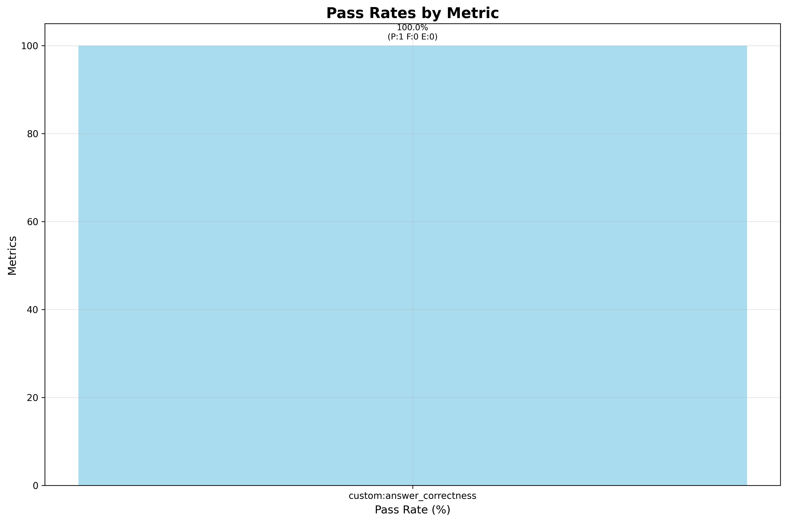
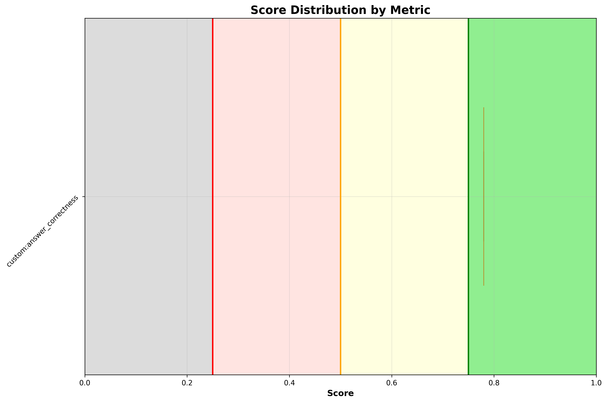

# ✅ check_mesh_status_no_kiali

**OLS model:** `openai/gpt-5` &nbsp;|&nbsp; **Judge:** `openai/gpt-5.4-mini`  
**Run:** 2026-06-15 11:22:41 &nbsp;|&nbsp; **Evaluations:** 1 &nbsp;|&nbsp; ✅ 1 PASS &nbsp; ❌ 0 FAIL &nbsp; ⚠️ 0 ERROR &nbsp; (100%)

> Check the status of the mesh and identify any issues.

---

## Pass Rates



<details>
<summary>More graphs</summary>

### Score Distribution



### Status Breakdown


</details>

## Metrics

| Metric | ✅ | ❌ | ⚠️ | Pass Rate | Mean Score |
|---|---|---|---|---|---|
| `custom:answer_correctness` | 1 | 0 | 0 | ✅ 100% | 0.78 |

## Turns

### Turn: `diagnose`

**Metrics:** `custom:answer_correctness`

**Query:** Check the status of the mesh and identify any issues.

| Metric | Result | Score |
|---|---|---|
| `custom:answer_correctness` | ✅ PASS | `████████████░░░░` 0.78 |

<details>
<summary>Actual tool calls</summary>

- `resources_list`(apiVersion=maistra.io/v2, kind=ServiceMeshControlPlane)
- `resources_list`(apiVersion=maistra.io/v1, kind=ServiceMeshMemberRoll)
- `namespaces_list`()
- `pods_list_in_namespace`(namespace=istio-system)
- `pods_list_in_namespace`(namespace=bookinfo)
- `events_list`(namespace=istio-system)
- `events_list`(namespace=bookinfo)
- `pods_log`(name=istiod-d468976dc-27ct2, namespace=istio-system, tail=200)
- `pods_log`(name=productpage-v1-574c45789d-s5jfq, namespace=bookinfo, container=istio-proxy, tail=120)

</details>

<details>
<summary>Agent response</summary>

```
Assessment: Service Mesh health and issues

Control plane (namespace: istio-system)
- Pods (all Running, Ready):
  - istiod-d468976dc-27ct2 (istiod) 1/1, IP 10.244.1.3
  - istio-ingressgateway-7554995647-dxc8w 1/1, IP 10.244.1.5
  - istio-egressgateway-69b8465445-prfp4 1/1, IP 10.244.1.4
  - prometheus-6964c8fbb8-bsrsj 2/2, IP 10.244.1.6
  - jaeger-555f5df568-lmzc7 1/1, IP 10.244.1.8
  - kiali-79f9fc974c-79mxq 1/1, IP 10.244.1.9
- Istiod evidence:
  - XDS active with 9 ConnectedEndpoints; multiple successful CDS/LDS/RDS/EDS pushes.
  - Only “no endpoints” messages during initial bring‑up; none persisting afterward.

Data plane (example namespace: bookinfo)
- Sidecar injection enabled (labels: istio-injection=enabled, istio.io/rev=default).
- Pods (all Running, Ready, sidecars present):
  - productpage-v1-574c45789d-s5jfq 2/2, IP 10.244.1.15
  - details-v1-6cc9db646f-2w7wv 2/2, IP 10.244.1.10
  - ratings-v1-59d4b8b76f-8zdlz 2/2, IP 10.244.1.11
  - reviews-v1/v2/v3 2/2 each, IPs 10.244.1…
```

</details>

<details>
<summary>Expected response</summary>

Without Kiali/OSSM MCP tools, the agent should provide a structured Istio mesh health assessment using Kubernetes-native tools (namespaces_list, resources_list, pods_list, events_list, pods_log), typically organized as:
Control plane — verify istiod Deployment is available in istio-system and inspect its logs for xDS push activity, sidecar injection events, and error patterns. Report observability stack Deployment availability (Kiali, Prometheus, Jaeger). Note gateway Deployments (ingressgateway, egressgateway) and their status.
Data plane — list pods in application namespaces (e.g. bookinfo) and verify sidecars are injected (expected 2/2 containers Ready); check for mTLS labels (e.g. security.istio.io/tlsMode=istio); inspect events for injection activity and any transient or persistent errors.
Config/traffic management — inspect Istio config objects (Gateway, VirtualService) to confirm routing is defined; verify Gateway selectors match the intended ingressgateway and VirtualService hosts are correct.
Issues found — report numbered findings with severity when problems exist, each including: concrete evidence from tool output (Deployment replicas, pod status, log content, event messages), the impact on mesh operations, and a specific remediation using kubectl (e.g. delete duplicate resources, patch labels). Examples of findings: duplicate ingressgateway Deployments across namespaces, image/label version mismatches, misconfigured Gateway selectors, or pods missing sidecar injection.
Next steps and conclusion — provide kubectl commands to remediate identified issues and conclude with the overall mesh status, clearly distinguishing what is healthy from what needs action.

</details>

---

*Tokens — Judge: 1,970 | API: 97,178 | Total: 99,148*
*Latency — mean: 53.8s | p95: 53.8s*